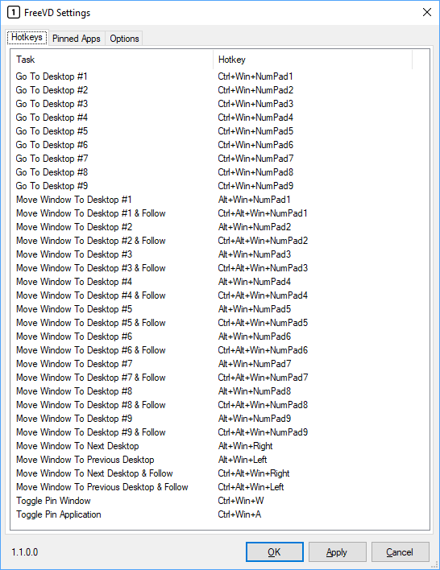
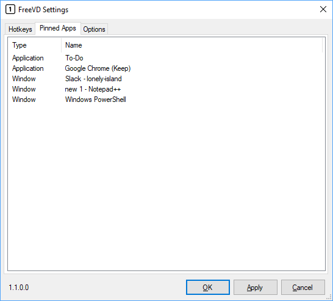

# FreeVD
Windows 10 Virtual Desktop Hotkeys and System Tray Icon

## Installation
Install the app automatically with [Chocolatey](https://chocolatey.org)
```powershell
choco install FreeVD
```

## Features:

### Hotkeys:

These are the default hotkeys, which are fully customizable.



Navigate Desktops:  
<kbd>WIN</kbd>+<kbd>CTRL</kbd>+<kbd>Numpad</kbd>  

Move Windows:  
<kbd>WIN</kbd>+<kbd>ALT</kbd>+<kbd>Numpad</kbd>  
<kbd>WIN</kbd>+<kbd>ALT</kbd>+<kbd>LEFT</kbd> or <kbd>RIGHT</kbd>

Move Window & Follow:  
<kbd>WIN</kbd>+<kbd>CTRL</kbd>+<kbd>ALT</kbd>+<kbd>Numpad</kbd>  
<kbd>WIN</kbd>+<kbd>CTRL</kbd>+<kbd>ALT</kbd>+<kbd>LEFT</kbd> or <kbd>RIGHT</kbd>

## Window Pinning: 



Pin/Unpin Applications:  
<kbd>WIN</kbd>+<kbd>ALT</kbd>+<kbd>A</kbd>  
(Pinning an application will pin all windows of that application to appear on all desktops)

Pin/Unpin Windows:  
<kbd>WIN</kbd>+<kbd>ALT</kbd>+<kbd>W</kbd>  
(Pinning a window will pin only that window, not other windows from the same application)


---
FreeVD started as a fork from the [last FOSS version](https://github.com/mzomparelli/zVirtualDesktop/tree/b623c87da69e9b45cf87141a216787a30477b934) of [mzomparelli](https://github.com/mzomparelli)'s [zVirtualDesktop](https://github.com/mzomparelli/zVirtualDesktop), and has continued to be developed as free and open-source.